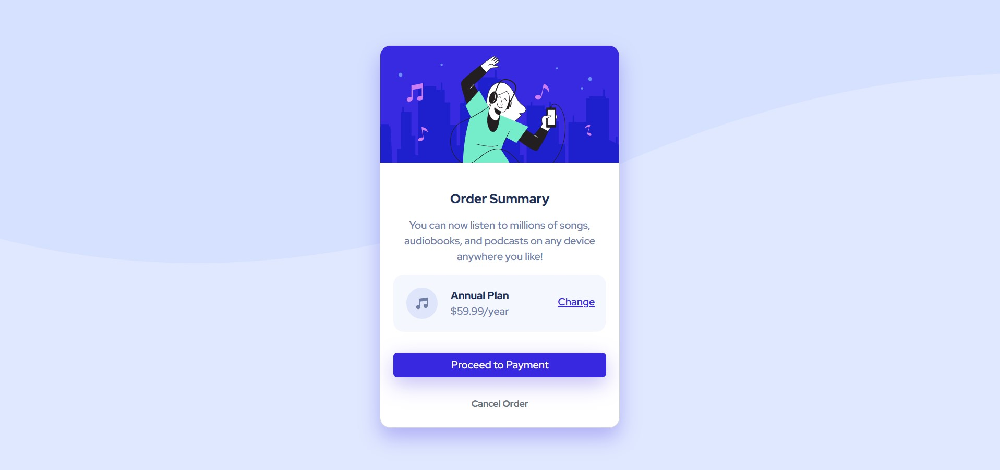
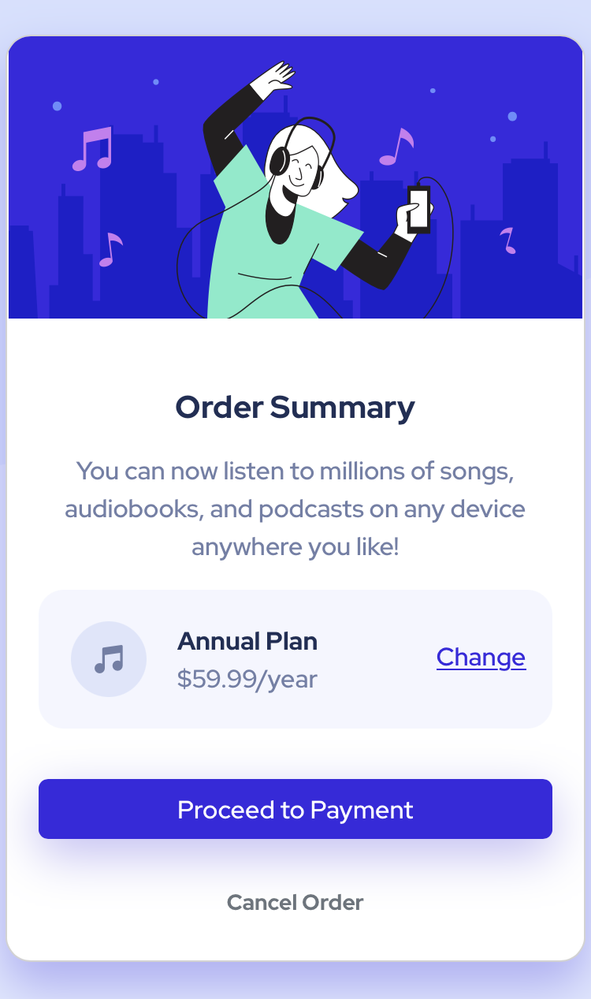

# Frontend Mentor - Order summary card solution

This is a solution to the [Order summary card challenge on Frontend Mentor](https://www.frontendmentor.io/challenges/order-summary-component-QlPmajDUj). Frontend Mentor challenges help you improve your coding skills by building realistic projects.

## Table of contents

- [Overview](#overview)
  - [The challenge](#the-challenge)
  - [Screenshot](#screenshot)
  - [Links](#links)
- [My process](#my-process)
  - [Built with](#built-with)
  - [What I learned](#what-i-learned)
  - [Useful resources](#useful-resources)
- [Author](#author)
- [Acknowledgments](#acknowledgments)

## Overview

### The challenge

Users should be able to:

- See hover states for interactive elements

### Screenshot

- Desktop version.
  

- Mobile version.
  

### Links

- Solution URL: [Source code on Github](https://github.com/Abaljerind/order-summary-component)
- Live Site URL: [Product Preview Card Component](https://order-summary-component-git-main-abaljerind.vercel.app/)

## My process

### Built with

- Semantic HTML5 markup
- CSS custom properties
- [Bootstrap](https://getbootstrap.com/) - For styles

### What I learned

With these css property below, outline and border, i now know how to make the button outline gone. This is actually my first time using both of property and it is really helping me and i'm proud i can find them useful.

```html
<h1>Some code I'm proud of</h1>
```

```css
section .buttons .cancel {
  ......
  outline: none;
  border: none;
}
```

### Useful resources

- [Bootstrap](https://getbootstrap.com/) - This helped me to do the styling more easy. I really liked this bootstrap and will use it going forward.
- [Vercel](https://vercel.com) - This is an amazing website which helped me to upload my website into the internet. I'd recommend it to anyone still learning to use this website.

## Author

- Website - [AbalJerind](https://order-summary-component-git-main-abaljerind.vercel.app/)
- Frontend Mentor - [@Abaljerind](https://www.frontendmentor.io/profile/Abaljerind)

## Acknowledgments

I want to thank me for believing in me, I want to thank me for doing all this hard work. I wanna thank me for having no days off. I wanna thank me for never quitting. I wanna thank me for being me at all times.
